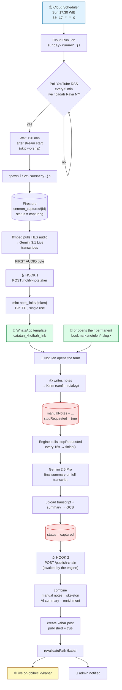
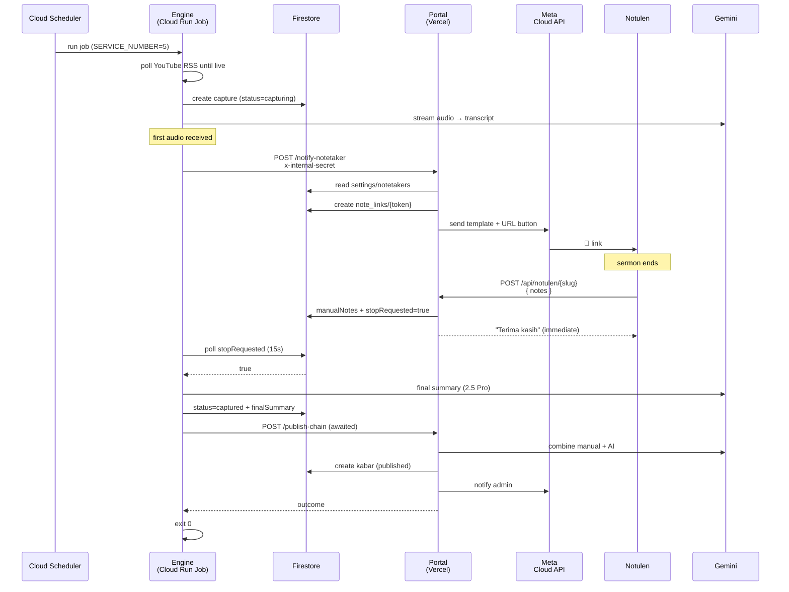
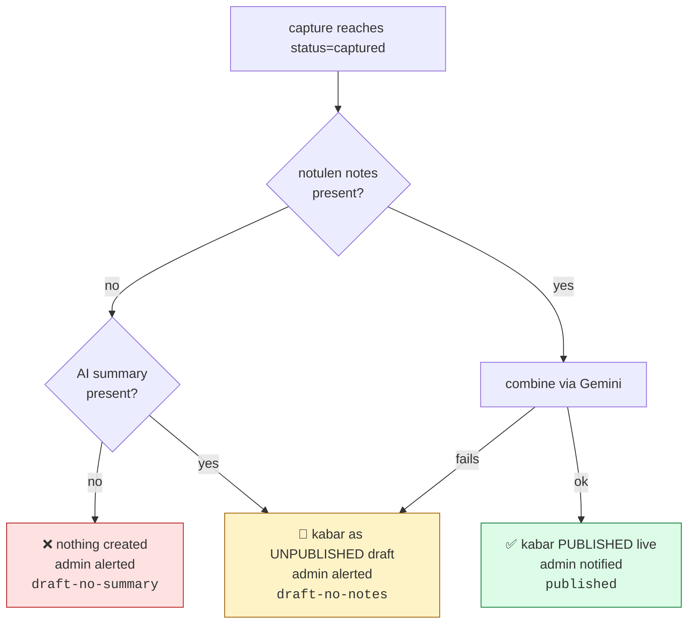
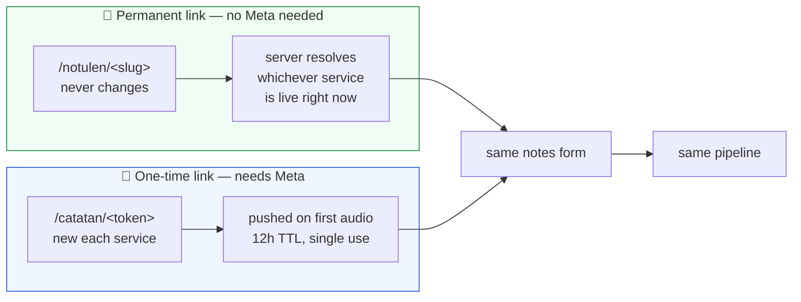
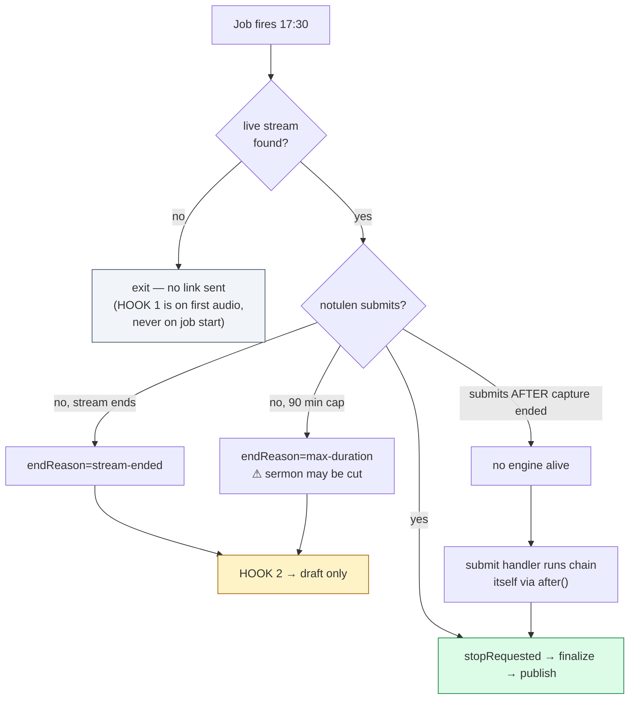
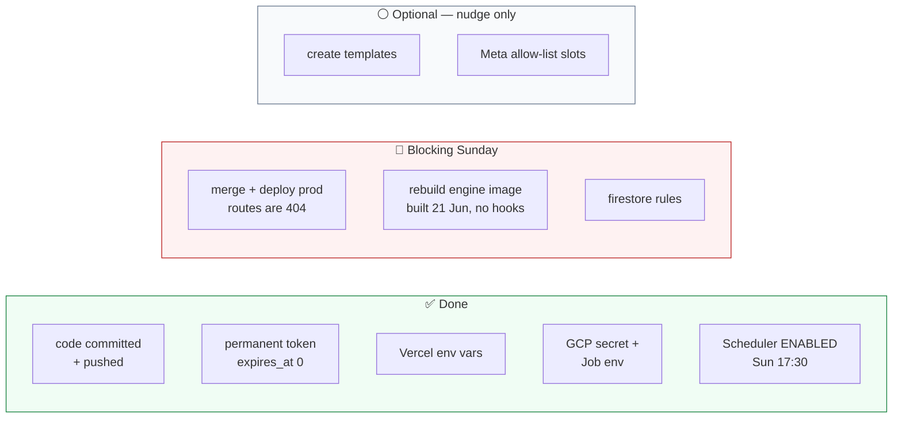

# Catatan Khotbah — Flow Diagrams

Visual companion to [`khotbah-automation.md`](./khotbah-automation.md). Diagrams
are Mermaid, so they render on GitHub.

---

## 1. The happy path

**The two red nodes are the whole trick.** Submitting the form writes the notes
*and* raises `stopRequested`. The engine was already polling that flag for the
admin's manual stop button, so the notulen inherits an existing mechanism rather
than needing a new one.

---

## 2. Who talks to whom

The engine **awaits** `/publish-chain` because the process exits immediately after;
an unawaited call would be killed mid-flight.

---

## 3. Publishing decision

**Only combined notes go public unattended.** The combine exists because ASR
mishears speaker names and Bible references; a notulen who was in the room has
cross-checked them. AI-only output has had no such check, so it stops at draft.

---

## 4. Two delivery paths

| | Permanent | One-time |
| --- | --- | --- |
| Needs a template | no | yes |
| Needs Meta allow-list | no | yes |
| Survives Meta breaking | **yes** | no |
| Delivery | bookmark once | automatic weekly |

The permanent link is the floor: if every Meta dependency fails, Sunday still
publishes.

---

## 5. Failure branches

---

## 6. Deployment status

Until **B1 and B2** land, next Sunday behaves exactly as today: it transcribes and
stops. Every hook lives in code that production has never seen.

---

## Code map

| Step | File |
| --- | --- |
| Scheduler → job | `gbi-bec-youtube-live-sync/deploy.sh` |
| Poll + spawn | `src/sunday-runner.ts` |
| Capture + both hooks | `src/live-summary.ts` — `callPortal()` |
| HOOK 1 target | `src/app/api/sermon-captures/[id]/notify-notetaker/route.ts` |
| Token mint / resolve | `src/lib/notetaker.ts` |
| Which service is live | `src/lib/notetaker.ts` — `findActiveCaptureForNotes()` |
| Public forms | `src/app/notulen/[slug]/`, `src/app/catatan/[token]/` |
| Submit + stop signal | `src/lib/notetaker-submit.ts` — `saveNotesToCapture()` |
| HOOK 2 target | `src/app/api/sermon-captures/[id]/publish-chain/route.ts` |
| Combine prompt | `src/lib/ai/combine-sermon.ts` |
| Kabar creation | `src/lib/sermon-kabar.ts` |
| WhatsApp senders | `src/lib/whatsapp.ts` |
